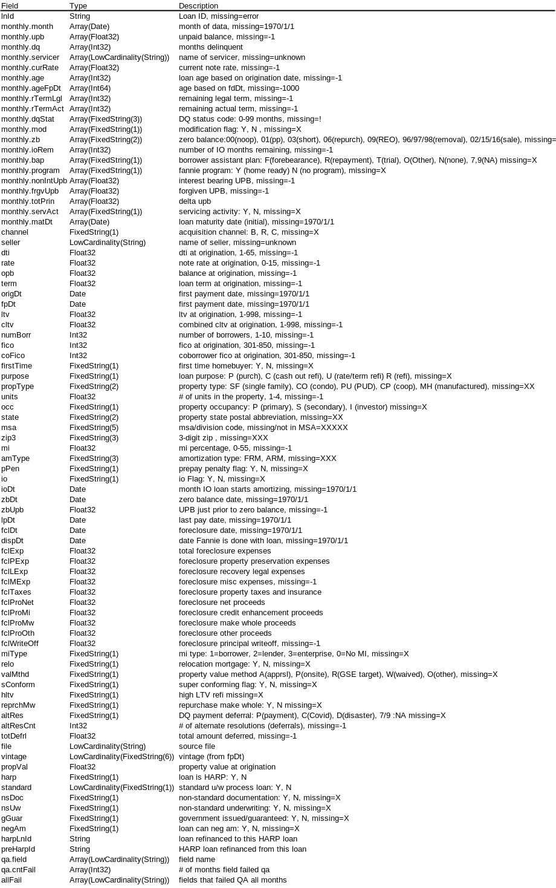

 Package fannie loads the standard, HARP and non-standard (excluded) loans made available by Fannie Mae into a ClickHouse 
 database.

 The final result is a single table with nested arrays for time-varying fields.
 Features:
   - New fields created are:
      - vintage (e.g. 2010Q2)
      - standard - Y/N flag, Y=standard process loan
      - loan age based on first pay date
      - numeric dq field
      - property value at origination
      - harp - Y/N flag, Y=HARP loan.
      - file name from which the loan was loaded
      - QA results. There are three sets of fields:
          - The nested table qa that has two arrays:
                - field.  The name of a field that has validation issues.
                - cntFail. The number of months for which this field failed qa.  For static fields, this value will
                   be 1.
           - allFail.  An array of field names which failed for qa.  For monthly fields, this means the field failed for all months.
   - A "DESCRIBE" of the output table provides info on each field.

 The command-line parameters are:

    -host  ClickHouse IP address. Default: 127.0.0.1.
    -user  ClickHouse user. Default: default
    -password ClickHouse password for user. Default: <empty>.
    -table ClickHouse table in which to insert the data.
    -maptable.  Clickhouse table that maps pre-HARP loan ids to HARP ids.  This table is both created and used by the package.
    -create if Y, then the table is created/reset. Default: Y.
    -dir directory with Fannie Mae text files.
    -tmp ClickHouse database to use for temporary tables.
    -concur # of concurrent processes to use in loading monthly files. Default: 1.
    -memory max memory usage by ClickHouse.  Default: 40000000000.
    -groupby max_bytes_before_external_groupby ClickHouse paramter. Default: 20000000000.

 The non-standard loan files have four additional fields.  This package recognizes whether the file is standard or 
 non-standard.  
 
A combined table can be built by running the app twice pointing to the same -table.
On the first run, set 

    -create Y 

and set

     -create N 
for the second run.

Note: for this package to run correctly, the standard loans should be loaded ***first***, so that the table that
maps HARP loans to their corresponding pre-HARP loan is loaded and available.  This table isn't needed after all the
files are loaded.

A DESCRIBE of the final table produces:

The data is available at [here](https//:datadynamics.fanniemae.com/data-dynamics/#/reportMenu;category=HP).
